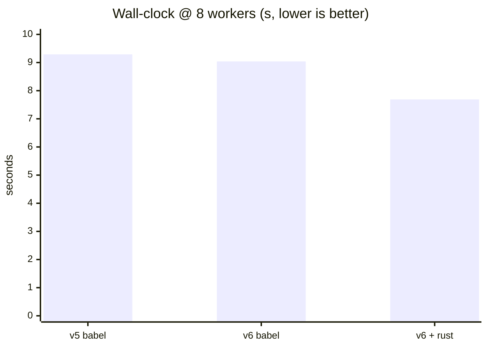
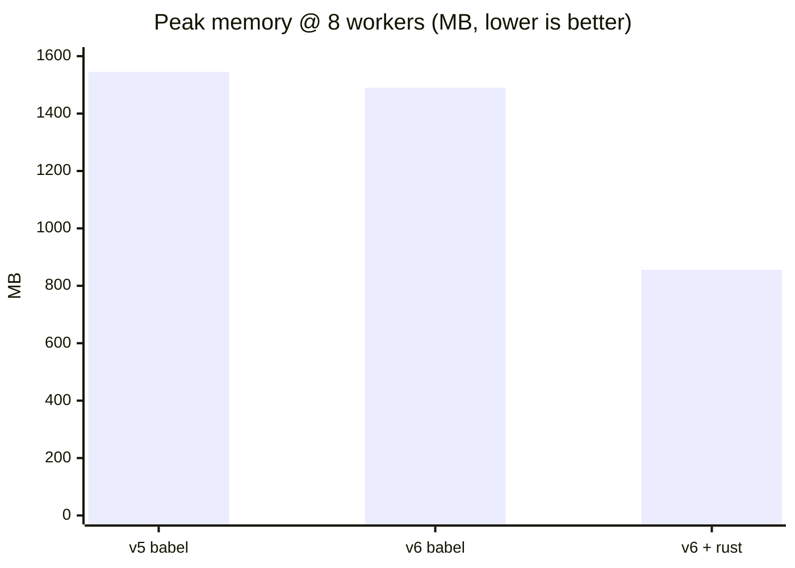
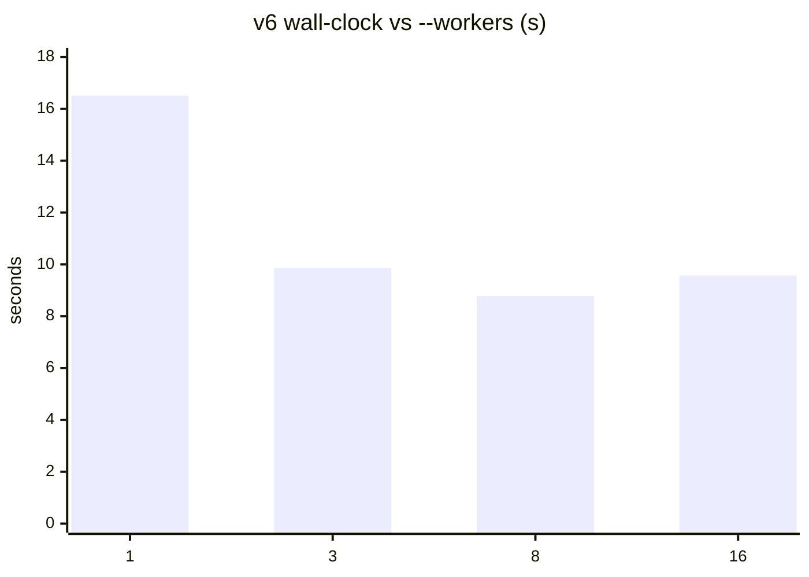
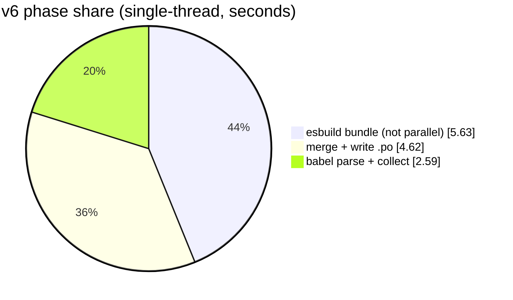
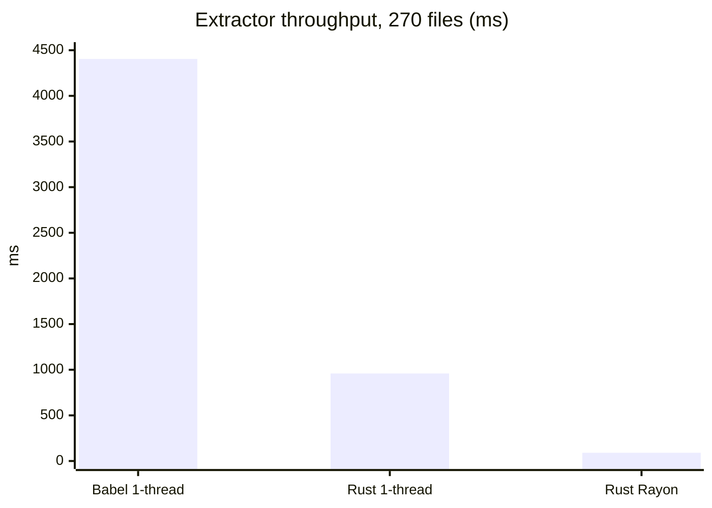

# lingui-extract-bench

A reproducible benchmark harness for the **Lingui experimental (esbuild) message
extractor** (`lingui extract-experimental`), plus the analysis that motivated it.

It answers, with measurements:

- Where does extraction time actually go? (phase breakdown)
- How does it scale with `--workers`? (and why more workers can be *worse*)
- How much does upgrading v5 → v6 help?
- How fast is the native Rust (SWC) extractor vs Babel?
- What would a dependency-graph rewrite look like, and how fast could it be?

> TL;DR of the findings: the non-parallelizable **esbuild bundle** is the
> wall-clock floor (~44%), shared code is re-parsed once per entry
> (`splitting:false`), peak memory grows with `--workers`, and native extraction
> is ~5–49× faster than Babel — so a resolver-driven, parse-once rewrite is the
> real lever. Full write-up in [`docs/findings.md`](docs/findings.md).

## Results at a glance

Measured on a 20-core WSL2 box, heavy synthetic app (120 entries × 20 locales,
2400 `.po`). Charts render natively on GitHub (Mermaid). Numbers in
[`results/`](results/).

**End-to-end: old vs new lingui vs native Rust extractor (8 workers)**





The drop-in Rust extractor's headline is the **~43% memory cut** (856 vs 1490 MB);
wall-clock only drops ~15% because esbuild bundling and catalog writing are
untouched.

**Why more workers stop helping (v6, heavy app)**



**Where the time goes (v6, single-thread)** — esbuild bundle does *not*
parallelize across workers, so it caps wall-clock:



**Raw extractor throughput (270 files, ms — lower is better)** — parsing is *not*
the bottleneck once native:



## Layout

```
apps/
  synthetic/        # the extraction-TARGET app (deterministic generator + presets)
runners/
  v5/               # @lingui/cli 5.9.2 runner  (lingui.config: format:'po')
  v6/               # @lingui/cli 6.2.0 runner  (formatter()) + lingui-swc
tools/
  profile.mjs       # v6 phase profiler (bundle / babel / merge+write)
  profile-v5.mjs    # v5 phase profiler
  bench-extractor.mjs  # Babel vs lingui-swc throughput
scripts/
  bench-workers.sh     # worker scaling + peak RSS
  bench-ab-version.sh  # v5 vs v6 A/B
  bench-ab-w1.sh       # single-thread median
results/            # curated measurements (machine-tagged)
docs/findings.md    # analysis + dependency-graph rewrite design (oxc vs SWC)
```

`apps/*` are extraction targets; `runners/*` are version-pinned lingui projects.
Add more app shapes under `apps/` to extend coverage (see `apps/synthetic/README.md`).

## Requirements

- Node 18+ and **pnpm** (uses a pnpm workspace so the two lingui versions install
  side by side, each isolated in its own runner).
- `lingui-swc` ships prebuilt native binaries for common platforms.

## Quick start

```bash
pnpm install        # installs both runners (v5 + v6)
pnpm run bench:all  # runs every benchmark below
```

Individual benchmarks:

```bash
pnpm run bench:ab        # v5.9.2 vs v6.2.0, across worker counts, with peak RSS
pnpm run bench:ab-w1     # single-thread median (lowest-noise version comparison)
pnpm run bench:workers   # worker scaling for v6
pnpm run profile:v6      # phase breakdown (bundle / babel / merge+write), v6
pnpm run profile:v5      # phase breakdown, v5
pnpm run bench:extractor # Babel vs native Rust (lingui-swc) throughput
```

Each command regenerates the synthetic app first, so runs are deterministic and
comparable.

## Tuning the load

The default load is the `heavy` preset (≈ a mid-size multi-entry app). Dial it to
match your project:

```bash
# regenerate with custom params before running a bench
PAGES=200 IMPORTS_PER_PAGE=40 FILLER_FNS=120 \
  node apps/synthetic/generate.mjs --out runners/v6 --preset heavy
```

See `apps/synthetic/presets.mjs` for all knobs and what they cost.

## Results

Sample measurements (20-core WSL2) are in [`results/`](results/). They are
machine-specific — reproduce on your own hardware. Highlights:

| | finding |
|--|--|
| Phase floor | esbuild bundle ~44%, **not** parallelized across workers |
| Workers | sweet spot 3–8; peak RSS grows ~linearly with worker count |
| v5→v6 | ~8–17% (merge+write only); core unchanged |
| Drop-in Rust extractor | v6 + lingui-swc: **~15% faster + ~43% less RAM** at w=8, identical catalogs |
| Babel vs Rust (raw) | lingui-swc **4.6× single-thread, ~49× with Rayon**, identical output |

End-to-end three-way (heavy app, w=8): v5 **9.29s/1545MB** → v6 **9.04s/1490MB**
→ v6+Rust **7.69s/856MB**. The Rust extractor's big win is memory; the wall-clock
ceiling stays until esbuild bundling is replaced (see the rewrite design in docs).

## Found bug: lingui-swc drops messages after `declare module`

While A/B-testing the native Rust extractor on a real project, `lingui-swc`
(≤ 0.6.0) was found to **silently skip every message that appears after a TS
ambient declaration** (`declare module` / `declare global` / `declare namespace`).
Minimal reproduction + a CI guard live in
[`apps/swc-bug-repro/`](apps/swc-bug-repro/):

```bash
pnpm --filter @bench/app-swc-bug-repro repro        # reproduces (exits 1)
node scripts/check-declare-lingui.mjs <your-src>     # guard: flag at-risk files
```

Workaround (no fork): move ambient declarations into `*.d.ts` files.

## Credits / prior art

- [`lingui/js-lingui#2436`](https://github.com/lingui/js-lingui/issues/2436) — the
  maintainer's Rust-extractor effort and benchmarks.
- [`@lingui/swc-plugin`](https://github.com/lingui/swc-plugin) and
  [`lingui-swc`](https://www.npmjs.com/package/lingui-swc) /
  `timofei-iatsenko/lingui-rust-tools` — the native macro + extractor this builds on.

## License

MIT
